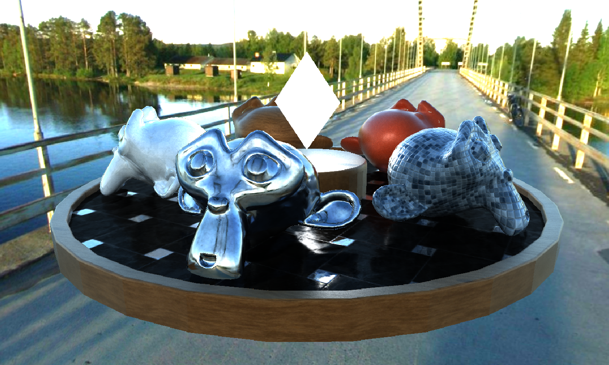

# OrayTracingRenderer

スクリーンスペースでレイトレースを行うパストレーシングレンダラーです。



[Examples](https://ukonpower.github.io/OrayTracingRenderer/gh-pages/examples/)


## Usage

レンダラーの作成
```typescript
let orayRenderer = new OrayTracingRenderer.Renderer( renderer, new THREE.Vector2( 500, 500 ) );

//レイの反射回数
orayRenderer.maxBounce = 5;
//レイ最大進行回数
orayRenderer.maxStep = 50;
//レイの進行距離
orayRenderer.rayDistance = 0.5;
//焦点距離
orayRenderer.focalDistance = 10.0;
//DoFのボケの大きさ
orayRenderer.dofBlurRadius = 0;

//レンダリング結果を初期化
orayRenderer.resetFrame();

```

描画対象のマテリアルの作成。  
```typescript
obj.material = new OrayTracingRenderer.Material( {
	albedo: new THREE.Vector3();
	emission: new THREE.Vector3()
	roughness: new number();
	metalness: new number();
	albedoMap: new THREE.Texture();
	emissionMap: new THREE.Texture();
	roughnessMap: new THREE.Texture();
	metalnessMap: new THREE.Texture();
	normalMap: new THREE.Texture();
} );
```

`THREE.StandardMaterial`を利用することもできます。

```typescript
obj.material = new OrayTracingRenderer.Material( {
	baseMaterial: baseObj.material
} );
```